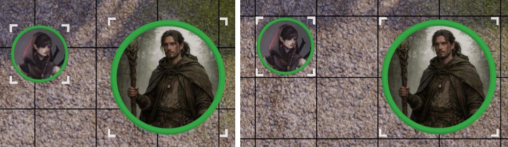

<!-- Header SVG -->

### Extensión para navegador que mejora tu experiencia en **Nivel20**

Añade funcionalidades útiles para DMs y jugadores de D&D.

> **Aviso:** Esta extensión no es oficial ni está afiliada a Nivel20. Es un proyecto independiente de la comunidad.

## Instalación

### Desde las tiendas oficiales (recomendado)

- **Chrome Web Store**: [Instalar en Chrome](https://chromewebstore.google.com/detail/jadlpdmjlfghndcehdhjhgndfmigbdoe?utm_source=item-share-cb)
- **Firefox Add-ons**: [Instalar en Firefox](https://addons.mozilla.org/es-AR/firefox/addon/nivel21/)

### Instalación manual (ultimos cambios)

1. Descarga el archivo **n21ext.zip** de la [última version](https://github.com/androettop/nivel21/releases/latest), o [descárga los últimos cambios](https://github.com/androettop/nivel21/archive/refs/heads/master.zip) (puede ser inestable)
2. Abre tu navegador y ve a `chrome://extensions/` (Chrome) o `about:debugging#/runtime/this-firefox` (Firefox)
3. Activa el "Modo de desarrollador" (Chrome)
4. En chrome, haz clic en "Cargar extensión sin empaquetar" y selecciona la carpeta de la extensión, o en Firefox haz clic en "Cargar complemento temporal" y selecciona el archivo `manifest.json`
5. ¡Listo! La extensión está activa en Nivel20

### Actualización manual

1. Descarga el nuevo ZIP de la extensión (o actualiza tu copia local).
2. **Chrome**: ve a `chrome://extensions/` y presiona el icono de **Actualizar** en la extensión. Si no aparece, elimínala y vuelve a cargarla.
3. **Firefox**: ve a `about:debugging#/runtime/this-firefox` y presiona en el icono **Recargar** en la extensión. Si no aparece, elimínala y vuelve a cargar el `manifest.json`.

## Características

> **Aviso:** Estas características dependen del funcionamiento interno de Nivel20 y pueden dejar de funcionar con futuras actualizaciones.

### Tiradas con Ventaja/Desventaja

Modifica automáticamente tus tiradas de dados manteniendo presionadas las teclas especiales mientras haces clic en un botón de tirada.

- **Shift** - Tirada con Ventaja
- **Alt** - Tirada con Desventaja

---

### Mediciones Persistentes

Mantén tus mediciones en el mapa de forma persistente. Usa el botón de anclaje en el panel de mediciones para activar o desactivar este modo.

- **Botón Toggle** - Activa/desactiva la persistencia de mediciones

---

### Compartir Contenido al Chat

Comparte rápidamente conjuros, items, reglas y otros contenidos con tu DM y compañeros. Los elementos se resaltan en azul cuando están listos para compartir.

- **Shift + Click** - Comparte el elemento al chat

---

### Enlaces en Mensajes del Chat

Los enlaces de reglas, objetos, conjuros y otros contenidos de Nivel20 se detectan automáticamente en el chat y se abren en ventanas internas.

- **Auto** - Los enlaces se convierten automáticamente al escribirlos

---

### Susurrar en el Chat

Envía mensajes privados a otros jugadores escribiendo `/w nombre`. El modo se cambia automáticamente a privado y solo el destinatario verá el mensaje. Los susurros se destacan en verde en el chat.

Los usuarios sin la extensión no podran recibir susurros.

- **/w nombre mensaje** - Enviar susurro privado
- **Tab** - Autocompletar nombre de usuario conectado (cicla entre coincidencias)

Ejemplos:

- **/w Lucius hola, ¿estás listo?**
- **/w "Ana María" ¿puedes revisar la pista?**

**Autocompletado con Tab:**

- Escribe `/w` y presiona Tab para ciclar entre todos los usuarios conectados
- Escribe `/w Lu` y presiona Tab para autocompletar usuarios que comienzan con "Lu"
- Presiona Tab varias veces para ciclar entre todas las coincidencias
- Las comillas se agregan automáticamente para nombres con espacios

---

### Atajos para Tokens

Controla rápidamente los tokens/fichas del mapa usando atajos de teclado. Selecciona un token primero para activar estos atajos:

| Tecla        | Acción                         |
| ------------ | ------------------------------ |
| **Ctrl + H** | Alternar visibilidad del token |
| **Ctrl + B** | Bloquear/desbloquear el token  |
| **Ctrl + E** | Editar el token seleccionado   |
| **Ctrl + D** | Duplicar el token seleccionado |
| **Delete**   | Eliminar el token seleccionado |

---

### Altura de Tokens

Permite ajustar la altura de uno o varios tokens seleccionados para colocarlos encima o debajo de otros.

| Tecla         | Acción                      |
| ------------- | --------------------------- |
| **Page Up**   | Subir altura del token (+1) |
| **Page Down** | Bajar altura del token (-1) |

---

### Mover Tokens con el Teclado

Permite mover uno o varios tokens seleccionados con las flechas del teclado.

| Tecla       | Accion                  |
| ----------- | ----------------------- |
| **Flechas** | Mover token una casilla |

---

### Ajustar a la Cuadrícula

Deshabilita el ajuste automatico de la cuadricula.
Mantén presionado Shift al mover tokens para forzarlos a ajustarse a la cuadrícula.

| Tecla                 | Acción                        |
| --------------------- | ----------------------------- |
| **Shift + Arrastrar** | Ajustar token a la cuadrícula |

---

### Distancia recorrida

Muestra automáticamente la distancia recorrida al arrastrar tokens por el mapa.

---

### Velocidad de arrastre de tokens

Incrementa la velocidad de las animaciones al arrastrar tokens por el mapa.
La velocidad es personalizable desde la configuración. 

Evita que los tokens se desacomoden al arrastrar varios a la vez por largas distancias.

---

### Efectos Ambientales

Crea capas de color sobre el tablero para simular horas del día, clima o eventos astronómicos. El DM puede ajustar color, intensidad y modo de fusión para ambientar la escena.

---

### Panel de Notas

Abre un panel flotante para tomar notas durante la partida. Las notas se guardan automáticamente en el navegador y persisten entre sesiones.

---

### Panel de Configuración

Centraliza todas las configuraciones de Nivel21 en un panel de ajustes.

---

### Carpetas anidadas

Nivel20 aún no soporta carpetas dentro de carpetas de forma nativa. Organiza acciones en carpetas usando el separador " > " en el nombre. La barra se convierte en carpetas anidadas automáticamente.

Ejemplo:

- Crea un item llamado "Ataques > Espadas > Estocada"
- Si quieres elegir un icono en la carpeta "Espadas", crea una acción "Carpeta" o "Sin acción" con nombre "Espadas" y selecciona el icono deseado.

---

### Enviar tokens al chat

Permite agregar notas descriptivas a los tokens que se pueden compartir con los jugadores. Los DMs pueden hacer clic derecho en un token para ver o enviar sus notas al chat.

- **Click derecho en token (DM)** - Ver/enviar notas del token
- **Notas visibles** - Se muestran con formato enriquecido en el chat

---

### Utilidades de cámara

Herramientas para los DMs que permiten controlar la cámara del mapa mediante el menú contextual.

- **Centrar cámara a todos** - Centra rápidamente la cámara de todos los jugadores en cualquier punto del mapa
- **Enderezar cámara** - Restablece la rotación de la cámara a 0 grados para una vista ortogonal perfecta

---

### Ping en el Mapa

Sistema de marcadores visuales animados para señalar ubicaciones en el mapa. Soporta múltiples presets con iconos animados y colores personalizados.

- **Click derecho en mapa** - Menú de ping
- **Comando manual** - `/ping x z [color] [icon]`

---

## Comunidad y Soporte

Este proyecto se desarrolla en conjunto con la comunidad.

Si tienes ideas, sugerencias o encuentras un error, únete a nuestro [servidor de Discord](https://discord.gg/KRHJm8x6rp).  
Ahí discutimos nuevas features, compartimos avances y damos soporte.

## Contribuciones

Las contribuciones son bienvenidas. Si encuentras un bug o tienes una sugerencia de mejora, siéntete libre de enviar un pull request.

## Apoya el Proyecto

Si te ha sido útil esta extensión, considera apoyar el proyecto:

